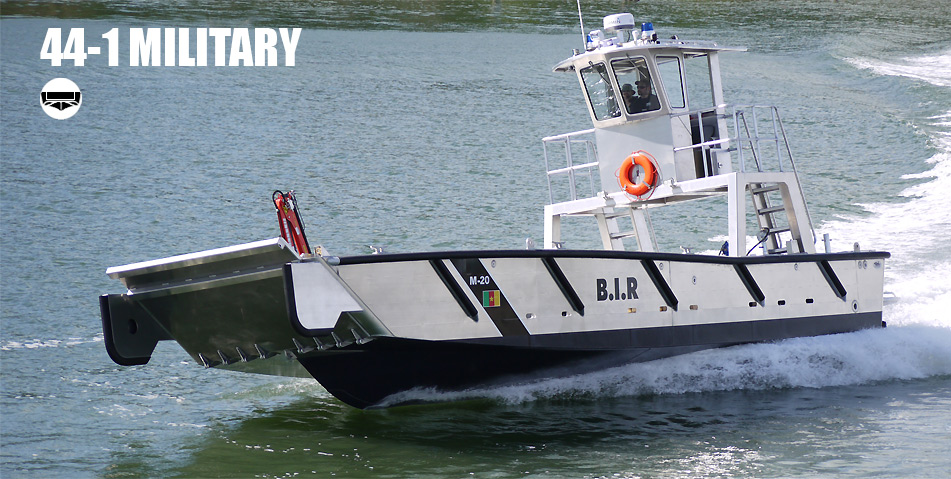

## Image Label Detection - [AWS](https://aws.amazon.com/rekognition/) Rekognition API - AUTH

- Image submitted for analysis


- Code for analysis - nodeJs
```js
const AWS = require('aws-sdk');
const rekognition = new AWS.Rekognition({region: "us-east-1"});

var params = {
  Image: {
   S3Object: {
    Bucket: "S3 BUCKET_NAME",
    Name: "ship.jpg"
   }
  },
  MaxLabels: 123,
  MinConfidence: 40
 };
 rekognition.detectLabels(params, function(err, data) {
   if (err) console.log(err, err.stack); // an error occurred
   else     console.log(data);           // successful response
 });
```

- Analysis Response - adjustment on Confidence set lower for testing:
```js
 { Labels:
   [ { Name: 'Boat', Confidence: 99.26506042480469 },
     { Name: 'Transportation', Confidence: 99.26506042480469 },
     { Name: 'Vessel', Confidence: 99.26506042480469 },
     { Name: 'Watercraft', Confidence: 99.26506042480469 },
     { Name: 'Ferry', Confidence: 94.4769287109375 },
     { Name: 'Yacht', Confidence: 69.96138000488281 },
     { Name: 'Dock', Confidence: 53.720726013183594 },
     { Name: 'Pier', Confidence: 53.720726013183594 } ],
  OrientationCorrection: 'ROTATE_0' }
```